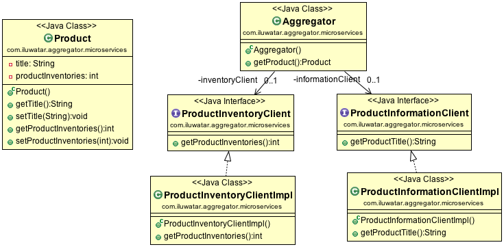

- Aggregator, focus on the dispatcher from multiple resources no matter whatever the platform.
- In this example, there are two http service interface. The aggregator could deal with the two services together.
- add a api-gateway. Include of multiple service method are provided to the outside.

